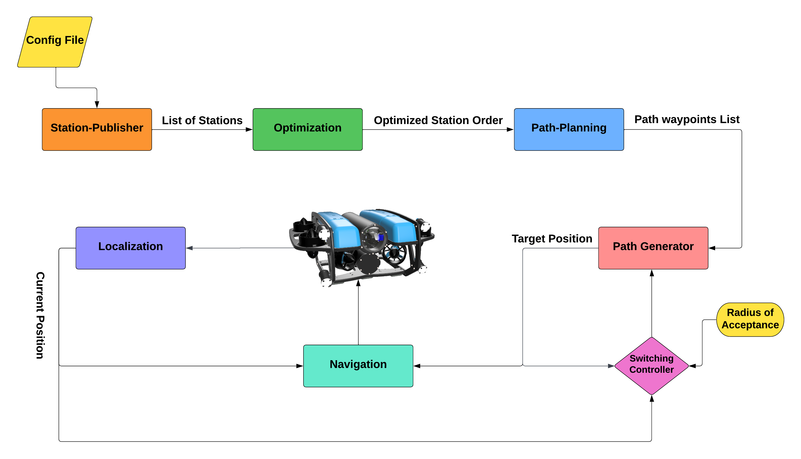
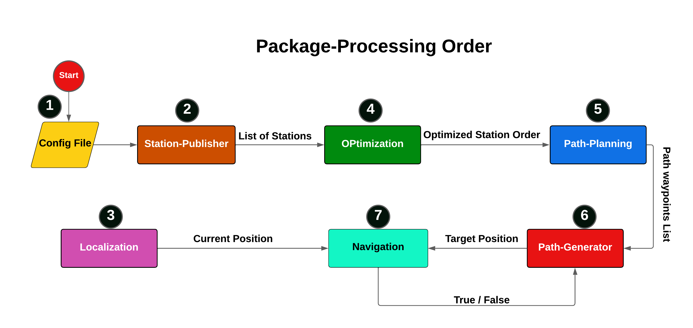
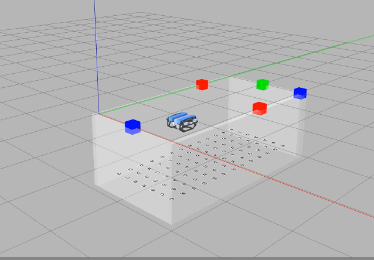

# Seagrass Supply Delivery (BlueROV- Underwater Robot)

# Main Process

# Project structure
This Project consists of mainly 8 package:
- **1- fav** : contains the main model , simulation environment ,gazebo plugins, etc.
- **2- station_publisher**: This package loads information about stations,.. from the configuration file and publishs it for other packages.
- **3- localization**: this package is responsible for localizing the robot and publishing information about the current position. 
- **4- optimization**: this package returns the best optimized stations' order with the shortest path to reach under some constraints.
- **5- path_planning**: this package calculates the shortest path from the first station to the last one according to the given order from optimization package.
- **6- path_generation**: this package takes the calculated path from path_planning pkg and generates it point by point to the controller (navigation_package).
- **7- navigation**: this package represnts the robot controller and is responsible for following the generated path by path_generation pkg.
- **8- web_ui**: a simple dashboard that add some features to dynamically control the robot beside some other actions and visualizations:

## Package order

 ## Getting Started
  
  ### Installation ###
   1. Go to your ROS package source directory:
        ~~~bash
        $ cd ros_workspace_path/src
        ~~~
   2. Clone this project.
        ~~~bash
        $ git clone -b main git@collaborating.tuhh.de:cxh8688/formulasandvehicels.git
        ~~~
   3. Go back to your ROS workspace:
        ~~~bash
        $ cd ../
        ~~~
   4. Build and install it:
        ~~~bash
        $ catkin build
        ~~~
   5. Reload your ROS env.
        ~~~bash
        $ source devel/setup.sh
        ~~~
## Gazebo Simulation

## Running diffrent work packages

1. optimization node
    ~~~bash
    $ roslaunch optimization main_optimizer.launch
    ~~~
2. path_planning node
    ~~~bash
    $ roslaunch path_planning path_planning.launch
    ~~~
3. path_generation node
    ~~~bash
    $ roslaunch path_generation path_generation.launch
    ~~~
4. navigation node
    ~~~bash
    $ roslaunch navigation navigation.launch
    ~~~ 
5. state machine

    ~~~bash
    $ roslaunch finalproject drop_off.launch
    ~~~ 

~~~bash
$ roscd simulation/scripts
$ python simulator.py
~~~
